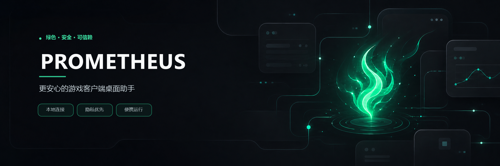

# Prometheus

  
  
  
  

Prometheus 是一款面向 Windows 的英雄联盟第三方桌面助手，通过本机
**League Client Update（LCU）API** 与英雄联盟客户端联动，将召唤师生涯、历史战绩、
实时对局、英雄选择辅助、游戏资源和常用自动化能力集中在一个现代化桌面应用中。

核心 LCU 通信直接连接本机回环地址，不依赖 Prometheus 自建的业务后端。英雄数据补充可能
访问公共 HTTPS 服务，但不会向外部站点附加 LCU 凭据。

> [!IMPORTANT]
> Prometheus 是非官方开源项目，与 Riot Games 不存在隶属、赞助或认可关系。
> 使用前请了解并遵守所在地区的游戏规则及相关服务条款。

> [!WARNING]
> **应用内在线更新尚未完成。** 当前版本不能直接在应用中下载和安装新版本。
> 需要升级时，请前往 [GitHub Releases](https://github.com/iamlovedit/Prometheus/releases)
> 手动下载最新的 MSI 安装包或便携 ZIP。

## 📖 导航

- [✨ 核心亮点](#highlights)
- [🧭 主要功能](#features)
- [🛡️ 安全与隐私](#security)
- [📦 下载与使用](#download)
- [❓ 常见问题](#faq)
- [🛠️ 从源码构建](#development)
- [🤝 参与共建与分享](#contributing)
- [⚖️ 免责声明与许可证](#license)

## ✨ 核心亮点

| 特性 | 说明 |
|------|------|
| 🔒 **本地连接** | 核心数据通过本机 LCU HTTPS 与 WebSocket 获取，认证信息仅用于对应的回环地址 |
| 🧩 **非侵入式辅助** | 不向客户端或游戏进程注入代码，不读取屏幕图像，也不修改英雄联盟客户端窗口内容 |
| ⚡ **实时状态联动** | 跟随大厅、匹配、就绪检查、英雄选择和游戏阶段实时刷新 |
| 🤖 **可控自动化** | 自动接受、自动重连、自动 Pick/Ban 和大乱斗自动交换均可独立启停 |
| 🌍 **个性化体验** | 支持简体中文与英文、明亮与暗黑主题，并可跟随 Windows 系统主题 |
| 📦 **安装方式灵活** | GitHub Release 同时提供 Windows x64 MSI 安装包和 self-contained 便携 ZIP |

## 🧭 主要功能

| 模块 | 主要能力 |
|------|----------|
| 🏠 主页 | 客户端连接状态、当前召唤师、最近对局、快捷操作与快速创建匹配房间 |
| 🧑‍🚀 生涯 | 等级、段位、近期表现、历史比赛和自定义生涯背景 |
| 🔍 战绩查询 | 通过完整 Riot ID 搜索玩家，查看近期战绩、英雄、装备和 KDA |
| ⚔️ 对局信息 | 按游戏阶段展示阵容、段位、最近 20 场胜率和平均 KDA |
| 🪟 选人助手 | 吸附在英雄联盟客户端侧边，展示队友战绩与英雄自动化状态 |
| 🎨 游戏资源 | 浏览和导出英雄皮肤原画、浏览并下载召唤师头像 |
| 🤖 实用工具 | 练习房间、在线状态、个性签名、展示段位、自动 Pick/Ban 与大乱斗自动交换 |
| ⚙️ 设置 | 语言、主题、自动化开关、诊断日志与版本信息 |

### 🏠 主页与快速开始

主页汇总客户端连接状态、当前召唤师信息和最近对局，并提供高频游戏操作入口：

- 自动接受就绪检查与断线自动重连；
- 快速创建或切换单双排、灵活排位、极地大乱斗和海克斯大乱斗房间；
- 记住上次选择的模式，并在主页与系统托盘之间同步；
- 只有在客户端已连接、当前阶段允许且目标队列可用时才执行操作；
- 快速入口只创建或切换房间，不会自动开始匹配搜索。

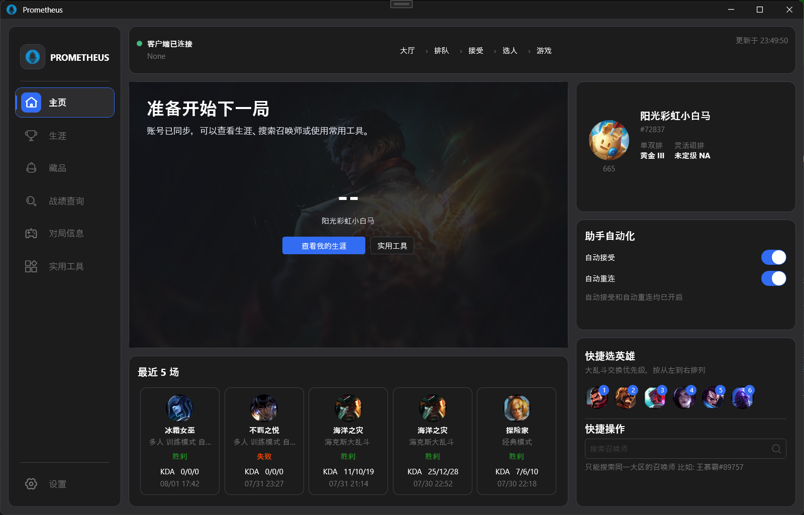

### 🧑‍🚀 召唤师生涯

生涯页面用于集中查看当前召唤师资料：

- 召唤师等级、单双排与灵活组排段位；
- 当前赛季表现、历史最高段位和上赛季结算段位；
- 最近比赛、胜负结果和常用英雄；
- 从英雄皮肤原画中选择并同步自定义生涯背景。

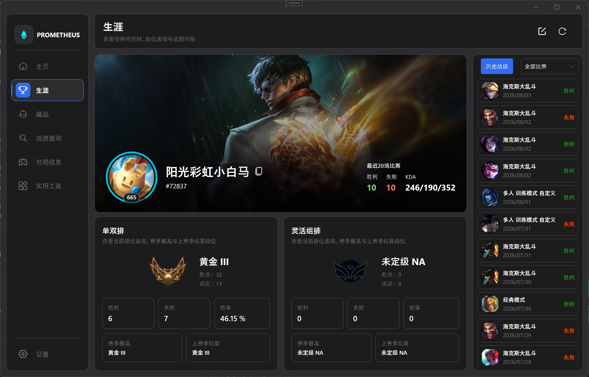

<strong>查看自定义生涯背景界面</strong>

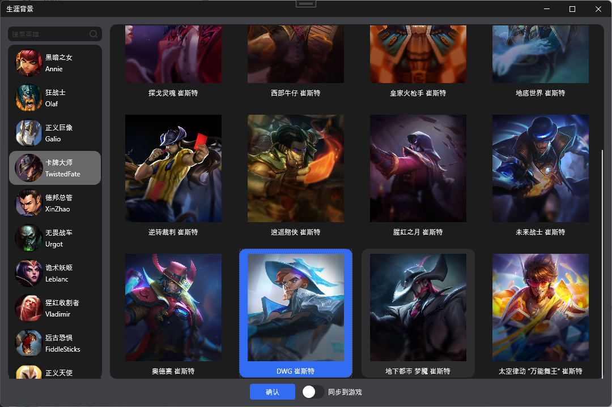

### 🔍 玩家搜索与历史战绩

使用完整的 <code>游戏名#标签</code> 搜索同一区域的召唤师，查看：

- 召唤师资料、等级与排位信息；
- 搜索结果直接保留在战绩查询页面，不会替换当前登录召唤师的生涯页面；
- 固定展示最近 20 场对局的胜负、模式、时间、英雄和 KDA；
- 选择一场比赛后查看双方阵容、装备、符文、召唤师技能、金币和伤害等详情；
- 在搜索结果中点击其他玩家时，继续留在战绩查询页面并切换到目标召唤师。

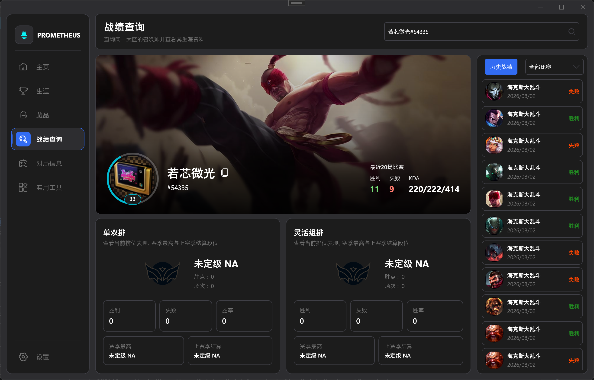

<strong>查看历史战绩与单局详情</strong>

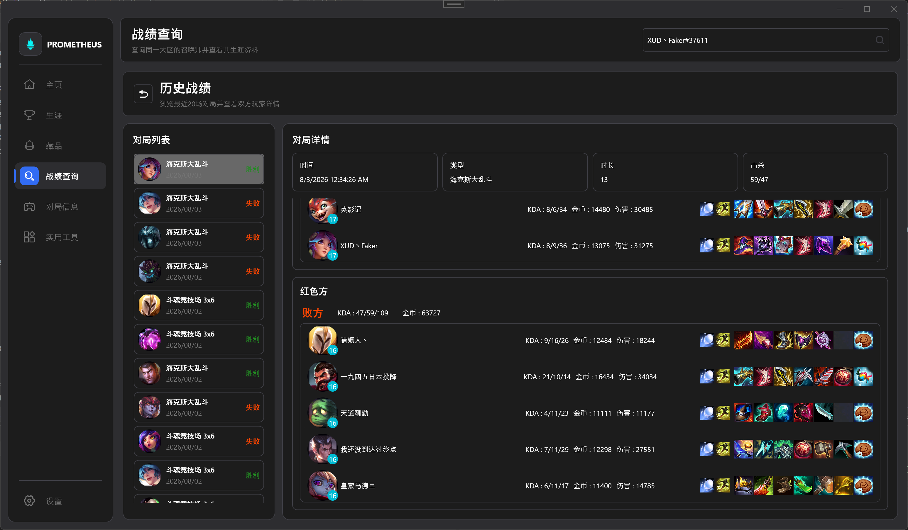

### ⚔️ 实时对局信息

对局页面跟随客户端状态实时更新，并根据当前阶段渐进展示可用数据：

- 展示双方阵容、英雄、段位与位置；
- 汇总玩家最近 20 场胜负、胜率、平均 KDA 和逐场表现；
- 选人阶段只加载当前允许获取的己方信息；
- 敌方身份尚未公开时保持隐藏占位，进入游戏后再加载可用资料；
- 单个玩家加载失败不会影响其他阵容成员。

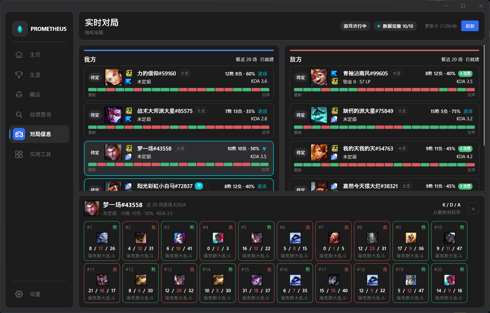

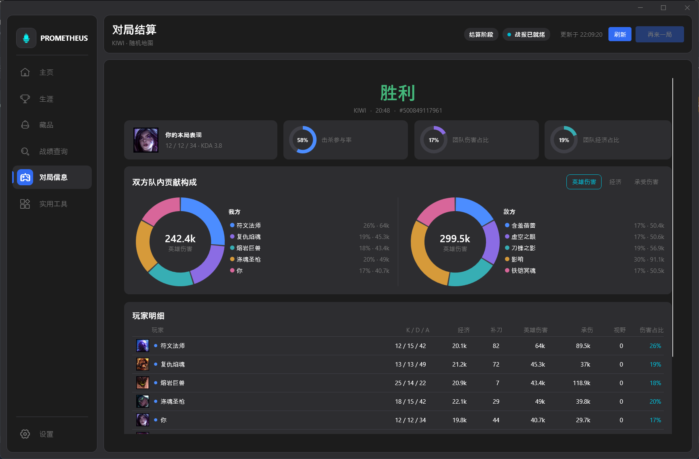

### 🪟 英雄选择伴随窗口

进入英雄选择阶段时，Prometheus 可以在英雄联盟客户端侧边显示一个紧凑的伴随窗口：

- 最多展示四名队友的段位、最近 20 场胜率和平均 KDA；
- 排位与匹配模式下展示自动 Pick、自动 Ban 的目标和执行状态；
- 极地大乱斗与海克斯大乱斗中展示当前英雄及自动交换候选；
- 跟随客户端移动、调整大小、最小化、恢复、跨显示器和 DPI 变化；
- 不全局置顶、不抢占客户端键盘焦点；
- 可从实用工具或系统托盘随时关闭，设置会跨应用启动保存。

该窗口由独立 WPF 窗口与公开 LCU API 组成，不向英雄联盟客户端或游戏进程注入代码，
不读取屏幕图像，也不修改客户端内容。

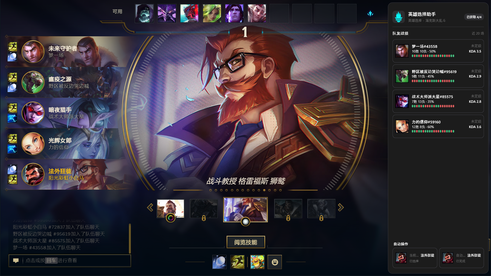

### 🎨 游戏资源浏览与导出

资源模块用于浏览英雄联盟客户端提供的静态美术资源：

- 按英雄搜索和浏览皮肤原画；
- 下载单张皮肤原画，或选择目录批量导出当前英雄的全部皮肤；
- 分页浏览召唤师头像并下载原始资源；
- 已缓存的资源会优先从本地读取，缺失资源可重新获取。

<table>
  <tr>
    <td width="50%" align="center"><strong>英雄皮肤原画</strong></td>
    <td width="50%" align="center"><strong>召唤师头像</strong></td>
  </tr>
  <tr>
    <td>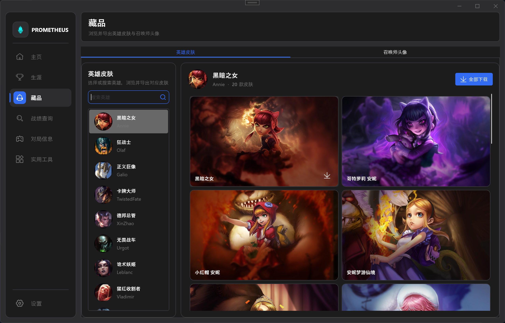</td>
    <td>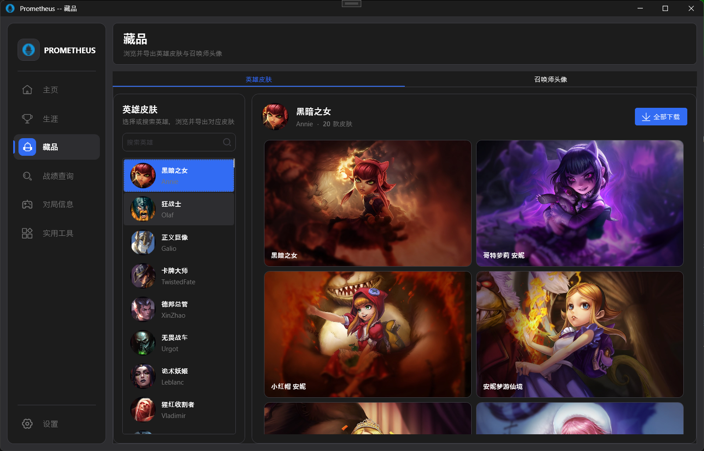</td>
  </tr>
</table>

### 🤖 自动化与实用工具

所有自动化能力都可以独立启停，并仅在对应游戏阶段执行：

- **自动 Pick**：按照候选英雄优先级选择当前可用英雄；
- **自动 Ban**：按照候选优先级禁用英雄，并避开队友预选；
- **大乱斗自动交换**：根据优先级从备战席交换目标英雄；
- **创建练习房间**：创建带可选密码的 5V5 练习模式房间；
- **社交资料设置**：修改在线状态、个性签名和客户端展示段位；
- **选人阶段吸附窗**：控制英雄选择伴随窗口是否自动显示。

自动接受和自动重连也可以在主页、设置或系统托盘中管理。

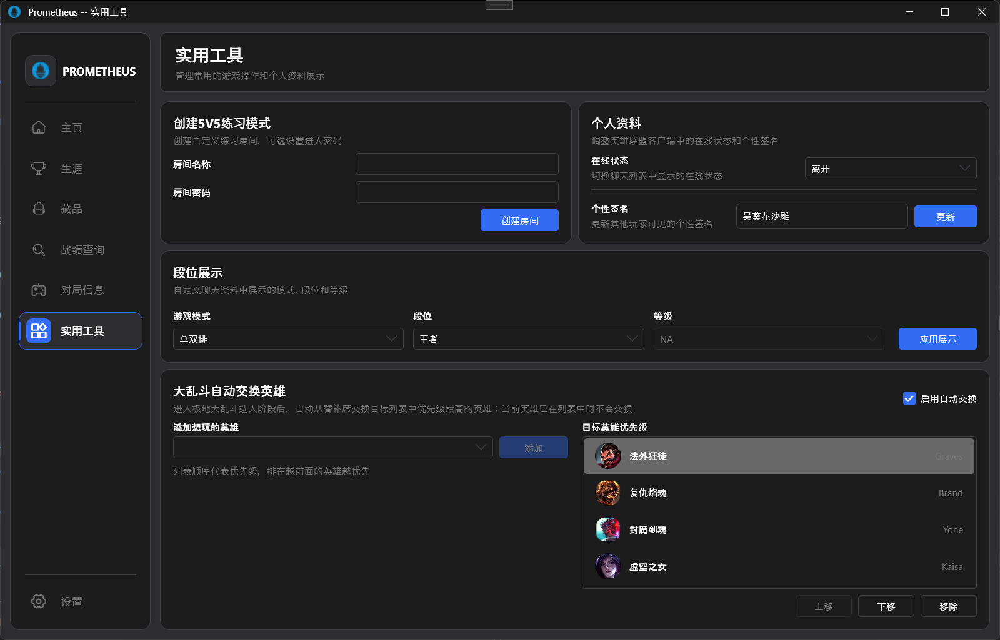

### ⚙️ 个性化、诊断与版本信息

设置页面集中管理应用体验和安全辅助能力：

- 简体中文与英文动态切换；
- 明亮、暗黑和跟随 Windows 系统主题；
- 自动接受对局和断线自动重连；
- 可选的运行日志与诊断面板；
- 查看当前应用版本和版本检查入口；
- 在线下载、自动安装与回滚链路尚未完成，更新需要手动下载安装包。

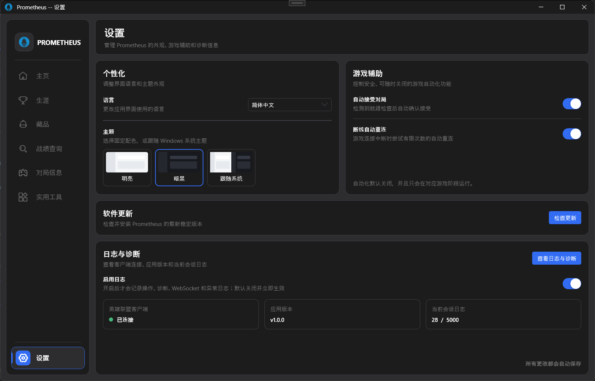

## 🛡️ 安全与隐私

Prometheus 将“本地连接、凭据隔离、可控自动化”作为重要设计原则：

| 领域 | 保护措施 |
|------|----------|
| LCU 凭据 | Token 只附加到协议、端口和主机均匹配的本机回环地址，不写入仓库或日志 |
| TLS | 只对本机 LCU 自签名证书放宽校验，公共 HTTPS 服务仍执行正常证书验证 |
| 外部请求 | 公共英雄数据服务不会收到 LCU Authorization 信息 |
| 伴随窗口 | 使用独立桌面窗口，不注入、不读取屏幕、不修改客户端窗口内容 |
| 诊断日志 | 默认关闭，可在运行时启停；敏感字段在进入日志前进行脱敏 |
| 隐私数据 | 不记录房间密码、完整命令行、完整 Riot ID、PUUID、聊天或个性签名正文 |
| 日志保留 | 诊断文件按天滚动并执行 7 天保留策略，关闭日志不会删除未过期的历史文件 |
| 当前发布 | GitHub Actions 构建 self-contained ZIP 与 MSI；应用内签名更新和自动回滚属于后续计划 |

> [!NOTE]
> 核心 LCU 功能在本机完成，但英雄梯度和推荐数据等能力需要访问公共 HTTPS 服务。
> 这些外部请求与 LCU 认证信息相互隔离。

## 📦 下载与使用

> [!WARNING]
> 应用内在线更新目前不可用。发现新版本后，需要关闭 Prometheus，
> 前往 [GitHub Releases](https://github.com/iamlovedit/Prometheus/releases)
> 下载新的 MSI 安装包或便携 ZIP，并手动完成升级。

### 系统要求

- Windows x64；
- 已安装英雄联盟客户端；
- 使用 LCU 相关功能时需要先启动英雄联盟客户端。

### 安装步骤

1. 前往 [GitHub Releases](https://github.com/iamlovedit/Prometheus/releases)；
2. 推荐下载最新稳定版的 Windows x64 MSI 安装包并按向导安装；
3. 也可以下载便携 ZIP，解压到具有写入权限的目录；
4. 启动英雄联盟客户端；
5. 从开始菜单启动 Prometheus，或在便携目录运行 <code>Prometheus.Desktop.exe</code>。

发布包采用 self-contained 方式构建，普通用户不需要单独安装 .NET SDK。
MSI 默认安装到当前用户目录，不需要管理员权限；卸载不会删除用户配置和日志。
应用关闭主窗口后可以继续驻留系统托盘。

### 更新现有版本

- **MSI 安装用户**：关闭 Prometheus，下载最新的 <code>Prometheus-&lt;version&gt;-win-x64.msi</code>
  并运行安装程序完成升级；
- **便携 ZIP 用户**：关闭 Prometheus，下载最新的
  <code>Prometheus-&lt;version&gt;-win-x64.zip</code>，解压到新的目录或替换原程序文件；
- 用户配置、日志和资源缓存保存在 <code>%LocalAppData%\Prometheus</code>，
  MSI 升级或卸载不会主动删除这些数据。

如果暂时没有可用的 Release，可以按照下方步骤从源码构建。

## ❓ 常见问题

<strong>Prometheus 是英雄联盟官方工具吗？</strong>

不是。Prometheus 是独立维护的第三方开源项目，与 Riot Games 不存在隶属、赞助或认可关系。

<strong>它会向游戏或客户端进程注入代码吗？</strong>

不会。Prometheus 使用英雄联盟客户端在本机提供的 LCU REST 与 WebSocket 接口。
英雄选择伴随功能也是独立桌面窗口，不读取客户端画面。

<strong>为什么必须先启动英雄联盟客户端？</strong>

LCU 的端口和临时认证信息由正在运行的英雄联盟客户端提供。客户端未运行或尚未完成启动时，
Prometheus 会保持断开状态并等待重新连接。

<strong>为什么选人阶段看不到敌方资料？</strong>

Prometheus 尊重客户端当前阶段的身份隐藏规则。选人阶段不会提前查询敌方身份，
只有进入游戏并获得可用阵容信息后才会加载对应资料。

<strong>自动化功能可以关闭吗？</strong>

可以。自动接受、自动重连、自动 Pick、自动 Ban、大乱斗自动交换和选人伴随窗口都有独立开关，
并且只在适用的游戏阶段运行。

<strong>Prometheus 是否需要联网？</strong>

核心 LCU 通信直接连接本机客户端。英雄梯度和推荐数据可能访问公共 HTTPS 服务，
但这些请求不会携带 LCU Token。应用内在线更新当前尚未启用。

<strong>如何更新 Prometheus？</strong>

当前需要前往 [GitHub Releases](https://github.com/iamlovedit/Prometheus/releases)
手动下载最新 MSI 安装包或便携 ZIP。应用中的在线下载、自动安装和失败回滚功能尚未完成。

## 🛠️ 从源码构建

开发环境需要 Windows 与 **.NET 10 SDK**。在仓库根目录执行：

~~~powershell
dotnet restore src/Prometheus.slnx
dotnet build src/Prometheus.slnx -c Release
dotnet test src/Prometheus.slnx -c Release
dotnet run --project src/Prometheus/Prometheus.csproj
~~~

收集测试覆盖率：

~~~powershell
dotnet test src/Prometheus.slnx --collect:"XPlat Code Coverage"
~~~

> [!WARNING]
> 重新构建前请先关闭正在运行的 <code>Prometheus.exe</code>，否则应用可能锁定已复制的模块 DLL。

### 技术栈

| 技术 | 用途 |
|------|------|
| .NET 10 / WPF | Windows 桌面客户端 |
| Prism | 模块化、依赖注入与 MVVM |
| LCU REST / WebSocket | 与英雄联盟客户端通信及实时状态订阅 |
| Serilog | 结构化操作日志与技术诊断 |
| xUnit / Moq / Coverlet | 单元测试、模拟依赖与覆盖率收集 |

### 项目结构

| 路径 | 说明 |
|------|------|
| <code>src/Prometheus/</code> | 应用外壳、启动入口、主窗口和托盘 |
| <code>src/Prometheus.Modules.&lt;Feature&gt;/</code> | Home、Summoner、Match、Search、Inventory、Setting、Utility 功能模块 |
| <code>src/Prometheus.Core/</code> | 共享模型、事件、MVVM 基类、本地化与资源 |
| <code>src/Prometheus.Shared/</code> | 可复用控件和展示模型 |
| <code>src/Services/</code> | LCU 通信、业务服务契约与实现 |
| <code>src/Prometheus.Updater/</code> | 桌面更新界面 |
| <code>src/Prometheus.Update/</code> | 更新协议与共享更新逻辑 |
| <code>src/Tests/</code> | xUnit 测试项目 |
| <code>specs/</code> | 功能行为、可信边界和验收标准的权威说明 |
| <code>doc/images/</code> | README 与文档截图 |

## 🤝 参与共建与分享

Prometheus 仍在持续完善中。欢迎玩家和开发者一起参与：

- ⭐ 为项目点一个 Star，并分享给更多有需要的朋友；
- 🐛 通过 [Issues](https://github.com/iamlovedit/Prometheus/issues) 报告问题和提交功能建议；
- 💡 分享使用体验、界面建议、截图或 GIF；
- 🌍 帮助完善简体中文与英文翻译；
- 🧪 补充服务、ViewModel、自动化和回归测试；
- 🧑‍💻 Fork 项目并提交 [Pull Request](https://github.com/iamlovedit/Prometheus/pulls)。

提交代码前请：

1. 阅读 [规格索引](./specs/README.md) 及与改动相关的功能规格；
2. 保持 <code>en-US.xaml</code> 与 <code>zh-CN.xaml</code> 的资源键同步；
3. 为服务、ViewModel 和回归问题添加有针对性的测试；
4. 在涉及 XAML、主题或布局时附上截图或 GIF；
5. 不提交 LCU Token、账号信息、未脱敏日志、<code>bin/</code> 或 <code>obj/</code>。

> [!TIP]
> 如果 Prometheus 对你有帮助，欢迎 Star、Fork、分享和推荐。
> 每一次反馈、文档改进和代码贡献，都会让这个项目更完善。

## ⚖️ 免责声明与许可证

- Prometheus 是非官方第三方项目，不代表 Riot Games 或英雄联盟官方立场；
- “Riot Games”“League of Legends”“英雄联盟”及相关游戏素材的权利归其各自权利方所有；
- 仓库中的界面截图仅用于介绍软件功能；
- 使用者应自行了解并遵守适用的游戏规则、服务条款和当地法律。

本项目使用 [GNU General Public License v3.0](./LICENSE)。
欢迎在许可证允许的范围内使用、研究、修改和分享 Prometheus。
